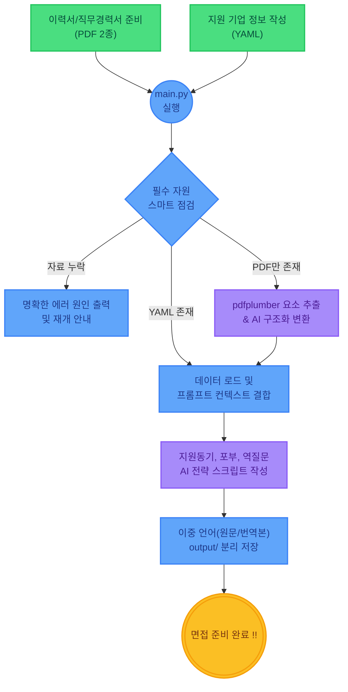

# AI-Agents.Naite (면접 준비 에이전트)

일본에서의 이직/취업 활동을 지원하는 AI 면접 코치 에이전트입니다.
사용자의 이력서, 직무경력서, 그리고 지원하려는 기업의 정보를 분석하여 기업에 맞춤화된 예상 면접 답변을 자동으로 생성합니다. LLM 프로바이더(Google Gemini 통신 또는 LM Studio 로컬 LLM) 선택을 지원하며, 파일 체크부터 스크립트 자동 생성까지 모든 면접 준비 과정이 한 번의 명령어로 자동 처리됩니다.

## 🚀 주요 기능

- **자동 PDF 변환**: 사용자의 이력서와 직무경력서 PDF 파일을 읽어들여 AI가 구조화된 형태의 YAML 포맷으로 자동 변환합니다.
- **맞춤형 면접 스크립트 생성**: 지원자의 이력 사항과 대상 기업의 상세 정보를 종합적으로 분석하여 최적화된 모범 면접 답변을 구상 및 제공합니다.
- **이중 언어 출력**: 지원동기, 향후 포부, 역질문 등 모든 생성 결과물은 **일본어(원문)**와 **한국어(번역본)** 코멘트가 각각 함께 작성되어 출력됩니다.
- **자동화 & 예외 처리 파이프라인**: 단 한 번의 에이전트 실행(`python main.py`)으로, 부족한 자료 체크, PDF 변환, Rate Limit(API 요청 제한시간 대기) 대응과 자동 재시도, YAML 저장까지 오류 없이 매끄럽게 처리됩니다.

## 🛠 기술 스택

- **Core & LLM Orchestration**: Python 3.x, `google-adk`, `litellm`
- **Document Processing**: `pdfplumber` (PDF 추출)
- **Data Serialization**: `pyyaml` (설정 및 데이터 포맷 처리)
- **Environment Management**: `python-dotenv`
- **Supported AI Models**: Google Gemini API, LM Studio (Local LLM Support)

## 🔄 워크플로우 (UX 관점)

면접 준비 과정에서 사용자의 개입을 최소화하도록 설계된 원활한 실행 흐름입니다.



## 📁 결과물 목록

실행이 완료되면 루트의 `output/` 디렉토리에 다음 파일들이 자동 생성됩니다.

| 생성 파일 | 설명 |
|:---|:---|
| `output/shibou_douki.yaml` | 지원 동기 |
| `output/kongo_nanika.yaml` | 향후에 무엇을 하고 싶은지 (입사 후 포부 / 목표) |
| `output/gyaku_shitsumon.yaml` | 면접 말미에 필요한 역질문 목록 (기본 3개) |

## ⚙️ 설치 및 설정 가이드

### 1. 파이썬 가상 환경 설정
```bash
# 가상 환경 생성
python -m venv .venv

# 가상 환경 활성화 (Windows)
.venv\Scripts\activate

# 가상 환경 활성화 (macOS / Linux)
# source .venv/bin/activate
```

### 2. 의존성 패키지 설치
```bash
pip install -r requirements.txt
```

### 3. 환경 변수(.env) 세팅
```bash
copy .env.example .env
```
복사한 `.env` 파일을 에디터로 열어 자신의 환경에 맞춰 설정합니다.
- `LLM_PROVIDER`: 사용할 LLM을 설정합니다. (기본값: `lmstudio` 혹은 구글 API 사용 시 `gemini`)
- `GOOGLE_API_KEY`: Gemini 모델 호출용 Google AI Studio 발급 보안 키
- `GEMINI_MODEL`: `gemini-2.0-flash` 등 적용하고자 하는 Gemini 기반 모델 이름
- `LMSTUDIO_BASE_URL`: 로컬 LLM 구동 시 서버의 기본 주소 (기본값: `http://localhost:1234/v1`)

## 📖 사용 방법

### (1) 준비 단계: 기본 자료 배치

다음 규칙에 맞추어 프로젝트의 `data/` 디렉토리에 문서를 준비합니다.
1. **이력서 (PDF)**: `data/resume.pdf`
2. **직무경력서 (PDF)**: `data/career.pdf`
3. **지원 대상 기업 정보 (YAML)**: `templates/target_company_template.yaml` 내용의 틀을 복사하여 `data/target_company.yaml`로 이름을 바꾼 후, 현재 지원할 기업의 분석 정보(업계, 인재상 등)를 기입합니다.

### (2) 실행 단계: 메인 스크립트 실행

사전 준비가 완료되었다면 에이전트를 가동합니다.

```bash
python main.py
```

**[실행 후 자동 워크플로우 점검 프로세스]**
1. 준비 상태 검토 과정 (누락 파일이 있다면 진행 불가 안내)
2. `resume.pdf`, `career.pdf` 파일을 스캔하여 텍스트를 추출한 뒤 `resume.yaml`, `career.yaml`로 변환 및 저장
3. 기업 정보와 이력을 조합하여 지원동기 / 향후 목표 / 역질문 스크립트 논리적 작성 
4. 완성된 모든 면접 결과물 `output` 디렉토리 자동 저장 

## 📂 저장소(프로젝트) 구조

```text
AI-Agents.Naite/
├── interview_agent/          # AI 면접 코치 로직 패키지
│   ├── config.py             # 연결 LLM 프로바이더 환경 설정
│   ├── prompts.py            # 각 문서 생성을 위한 핵심 프롬프트
│   └── tools/                # 내부 기능 함수 폴더
│       ├── pdf_converter.py  # PDF 파일 텍스트 추출 + 구조화된 YAML 변환
│       ├── file_loader.py    # 데이터 검증(상태 체크) 및 로더
│       └── output_writer.py  # 가공된 면접 스크립트를 파일로 저장 
├── data/                     # 사용자 입력 문서 저장(PDF 이력서, 대상 기업) 폴더
├── output/                   # 최종 추출 및 답변 생성물 결과 YAML 폴더
├── templates/                # 각종 데이터 입력을 위해 제공되는 템플릿
├── main.py                   # 애플리케이션의 엔트리 포인트 (자동화 실행기)
├── test_llm.py               # LiteLLM 연동 체크 및 모델 작동 테스트 모듈
├── requirements.txt          # 파이썬 의존성 패키지 리스트
└── .env.example              # 환경 설정 예시 템플릿
```
