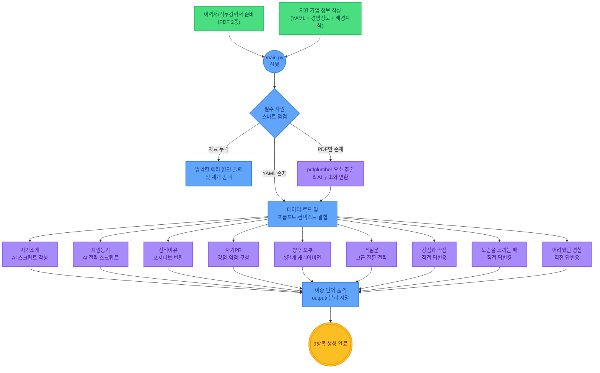

# AI-Agents.Naite (면접 준비 에이전트)

일본에서의 이직/취업 활동을 지원하는 AI 면접 코치 에이전트입니다.
사용자의 이력서, 직무경력서, 그리고 지원하려는 기업의 정보를 분석하여 기업에 맞춤화된 예상 면접 답변을 자동으로 생성합니다. LLM 프로바이더(Google Gemini 통신 또는 LM Studio 로컬 LLM) 선택을 지원하며, 파일 체크부터 스크립트 자동 생성까지 모든 면접 준비 과정이 한 번의 명령어로 자동 처리됩니다.

## 주요 기능

- **자동 PDF 변환**: 사용자의 이력서와 직무경력서 PDF 파일을 읽어들여 AI가 구조화된 형태의 YAML 포맷으로 자동 변환합니다.
- **맞춤형 면접 스크립트 생성 (7항목)**: 지원자의 이력 사항과 대상 기업의 상세 정보를 종합적으로 분석하여 최적화된 모범 면접 답변을 구상 및 제공합니다.
- **이중 언어 출력**: 자기소개, 지원동기, 전직이유, 자기PR, 향후 포부, 전직축, 역질문 등 모든 생성 결과물은 일본어(원문)와 한국어(번역본) 코멘트가 각각 함께 작성되어 출력됩니다.
- **최종 면접(役員面接) 모드**: `--final` 플래그로 최종 면접 전용 모드를 활성화하여, **겸손함(謙虚さ)을 중시**하고 **「미래」를 테마**로 한 장기적 시점의 답변을 자동 생성합니다. 역질문도 役員クラス 대상으로 특화됩니다.
- **전문가 감수 나레지베이스**: 면접 대책 자료 4문서(면접대책시트, 면접질문, 비즈니스매너기본, 전직이유포인트)에서 추출한 화법규칙·경어규칙·전직이유 전략을 프롬프트에 주입하여 출력 품질을 고도화했습니다.
- **자동화 & 예외 처리 파이프라인**: 단 한 번의 에이전트 실행(`python main.py`)으로, 부족한 자료 체크, PDF 변환, Rate Limit(API 요청 제한시간 대기) 대응과 자동 재시도, YAML 저장까지 오류 없이 매끄럽게 처리됩니다.

## 기술 스택

- **Core & LLM Orchestration**: Python 3.x, `google-adk`, `litellm`
- **Document Processing**: `pdfplumber` (PDF 추출)
- **Data Serialization**: `pyyaml` (설정 및 데이터 포맷 처리)
- **Environment Management**: `python-dotenv`
- **Supported AI Models**: Google Gemini API, LM Studio (Local LLM Support)

## 워크플로우

면접 준비 과정에서 사용자의 개입을 최소화하도록 설계된 원활한 실행 흐름입니다.


```mermaid
graph TD
    classDef user fill:#4ade80,stroke:#22c55e,stroke-width:2px,color:#064e3b;
    classDef system fill:#60a5fa,stroke:#3b82f6,stroke-width:2px,color:#1e3a8a;
    classDef ai fill:#a78bfa,stroke:#8b5cf6,stroke-width:2px,color:#4c1d95;
    classDef result fill:#fbbf24,stroke:#f59e0b,stroke-width:2px,color:#78350f;
    classDef final fill:#f472b6,stroke:#ec4899,stroke-width:2px,color:#831843;

    %% 준비
    A1["이력서/직무경력서 준비<br>(PDF 2종)"]:::user
    A2["지원 기업 정보 작성<br>(YAML + 경영정보 + 배경지식)"]:::user

    A1 --> B(("main.py<br>실행")):::system
    A2 --> B

    %% 파이프라인 로직
    B --> C{"필수 자원<br>스마트 점검"}:::system
    C -- "자료 누락" --> Err["명확한 에러 원인 출력<br>및 재개 안내"]:::system

    C -- "PDF만 존재" --> D["pdfplumber 요소 추출<br>& AI 구조화 변환"]:::ai
    C -- "YAML 존재" --> E["데이터 로드 및<br>프롬프트 컨텍스트 결합"]:::system
    D --> E

    %% AI 분석 및 결과 (9항목)
    E --> F1["자기소개<br>AI 스크립트 작성"]:::ai
    E --> F2["지원동기<br>AI 전략 스크립트"]:::ai
    E --> F3["전직이유<br>포지티브 변환"]:::ai
    E --> F4["자기PR<br>강점·약점 구성"]:::ai
    E --> F5["향후 포부<br>3단계 캐리어비전"]:::ai
    E --> F6["역질문<br>고급 질문 전략"]:::ai
    E --> F7["강점과 약점<br>직접 답변용"]:::ai
    E --> F8["보람을 느끼는 때<br>직접 답변용"]:::ai
    E --> F9["어려웠던 경험<br>직접 답변용"]:::ai

    F1 --> G["이중 언어 출력<br>output/ 분리 저장"]:::system
    F2 --> G
    F3 --> G
    F4 --> G
    F5 --> G
    F6 --> G
    F7 --> G
    F8 --> G
    F9 --> G
    G --> H((("9항목 생성 완료"))):::result
```

## 결과물 목록

실행이 완료되면 루트의 `output/` 디렉토리에 다음 파일들이 자동 생성됩니다.

| 생성 파일                     | 설명                                            | 모드    |
| :---------------------------- | :---------------------------------------------- | :------ |
| `output/00. 自己紹介(자기소개).yaml` | 자기소개 (自己紹介)                             | 공통    |
| `output/01. 自己PR(자기PR).yaml`     | 자기PR — 강점 3개(에피소드포함) + 약점 1개(개선책포함) | 공통    |
| `output/02. 自身の強みと弱み(강점과 약점).yaml`  | 자신의 강점과 약점 (自身の強みと弱み) 직접 답변용 | 공통    |
| `output/03. やりがいを感じる時(일의 보람).yaml`         | 일에서 보람을 느끼는 순간 (やりがいを感じる時) | 공통    |
| `output/04. 最も困難だった経験(가장 어려웠던 경험).yaml`   | 인생에서 가장 어려웠던 경험 (最も困難だった経験) | 공통    |
| `output/05. 転職軸(전직축).yaml` | 전직축 | 공통    |
| `output/06. 転職理由(전직이유).yaml` | 전직이유 (転職理由)                             | 공통    |
| `output/07. 志望動機(지원동기).yaml` | 지원 동기 (志望動機)                            | 공통    |
| `output/08. 今後何がしたいか(향후 목표).yaml`    | 향후에 무엇을 하고 싶은지 (입사 후 포부 / 목표) | 공통    |
| `output/09. 逆質問(역질문).yaml` | 면접 말미에 필요한 역질문 목록 (기본 3개 + 의도 해설) | 공통    |

## 설치 및 설정 가이드

### 1. 파이썬 가상 환경 설정
```bash
# 가상 환경 생성
python -m venv .venv

# 가상 환경 활성화 (Windows)
.venv\Scripts\activate

# 가상 환경 활성화 (macOS / Linux)
# source .venv/bin/activate
```

### 2. 의존성 패키지 설치
```bash
pip install -r requirements.txt
```

### 3. 환경 변수(.env) 세팅
```bash
copy .env.example .env
```
복사한 `.env` 파일을 에디터로 열어 자신의 환경에 맞춰 설정합니다.
- `LLM_PROVIDER`: 사용할 LLM을 설정합니다. (기본값: `lmstudio` 혹은 구글 API 사용 시 `gemini`)
- `GOOGLE_API_KEY`: Gemini 모델 호출용 Google AI Studio 발급 보안 키
- `GEMINI_MODEL`: `gemini-2.0-flash` 등 적용하고자 하는 Gemini 기반 모델 이름
- `LMSTUDIO_BASE_URL`: 로컬 LLM 구동 시 서버의 기본 주소 (기본값: `http://localhost:1234/v1`)

## 사용 방법

### (1) 준비 단계: 기본 자료 배치

다음 규칙에 맞추어 프로젝트의 `data/` 디렉토리에 문서를 준비합니다.
1. **이력서 (PDF)**: `data/resume.pdf`
2. **직무경력서 (PDF)**: `data/career.pdf`
3. **지원 대상 기업 정보 (YAML)**: `templates/target_company_template.yaml` 내용의 틀을 복사하여 `data/target_company.yaml`로 이름을 바꾼 후, 현재 지원할 기업의 분석 정보(업계, 인재상 등)를 기입합니다.

> **최종 면접의 경우**: 템플릿의 `management:` 섹션(代表者挨拶, 経営理念, 経営方針)과 `background_notes:` 섹션(전직축·성장배경·기업평가·선고 포인트)을 반드시 기입해주세요. `|` 기호 다음 줄에 내용을 그대로 붙여넣기하면 됩니다.

### (2) 실행 단계: 메인 스크립트 실행

사전 준비가 완료되었다면 에이전트를 가동합니다.

```bash
# 일반 면접 (1차·2차)
python main.py

# 최종 면접 모드 (役員面接 — 謙虚さ + 未来テーマ)
python main.py --final
```

#### 일반 모드 vs 최종 면접 모드

| 항목 | 일반 모드 | 최종 면접 모드 (`--final`) |
| :--- | :--- | :--- |
| 시스템 프롬프트 | 표준 면접 코치 | + 겸손함(謙虚さ) + 미래 테마 |
| 상정 질문 | 정번 10선 | 최종면접용 8문항 + 전직축 심층 질문 |
| 역질문 | 현장 사원 대상 | 役員クラス 대상 (경영 비전·미래 전략) |
| 전직축 생성 | - | (1사→2사 전직 심층 대비 포함) |

**[실행 후 자동 워크플로우 점검 프로세스]**
1. 준비 상태 검토 과정 (누락 파일이 있다면 진행 불가 안내)
2. `resume.pdf`, `career.pdf` 파일을 스캔하여 텍스트를 추출한 뒤 `resume.yaml`, `career.yaml`로 변환 및 저장
3. 기업 정보와 이력을 조합하여 **7개 항목** 논리적 작성:
   - 자기소개 → 지원동기 → 전직이유 → 자기PR → 향후 목표 → (전직축) → 역질문
4. 완성된 모든 면접 결과물 `output` 디렉토리 자동 저장

## 저장소(프로젝트) 구조

```text
AI-Agents.Naite/
├── interview_agent/ # AI 면접 코치 로직 패키지
│ ├── config.py # 연결 LLM 프로바이더 환경 설정
│ ├── knowledge.py # 면접 나레지베이스 (최종면접 대응 v3.0)
│ ├── prompts.py # 각 문서 생성을 위한 핵심 프롬프트 (v3.0)
│ └── tools/ # 내부 기능 함수 폴더
│ ├── pdf_converter.py # PDF 파일 텍스트 추출 + 구조화된 YAML 변환
│ ├── file_loader.py # 데이터 검증(상태 체크) 및 로더
│ └── output_writer.py # 가공된 면접 스크립트를 파일로 저장
├── data/ # 사용자 입력 문서 저장(PDF 이력서, 대상 기업) 폴더
├── output/ # 최종 추출 및 답변 생성물 결과 YAML 폴더
├── templates/ # 기업 정보 입력 템플릿 (Copy&Paste 용이 형태)
├── main.py # 애플리케이션 엔트리 포인트 (--final 옵션 지원)
├── requirements.txt # 파이썬 의존성 패키지 리스트
└── .env.example # 환경 설정 예시 템플릿
```
